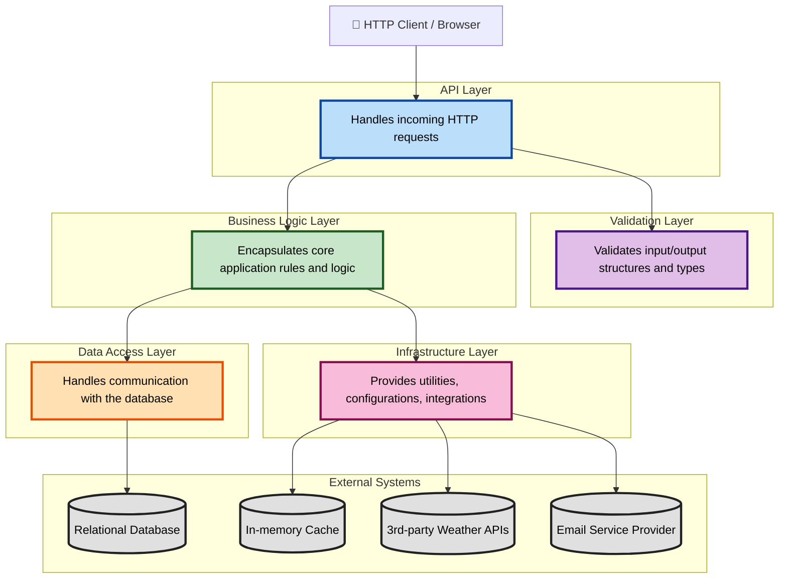

```mermaid
graph TB
    CLIENT[📱 HTTP Client / Browser]

    %% API Layer
    subgraph L1["API Layer"]
        API_CONTROLLER["Handles incoming HTTP requests"]
    end

    %% Validation Layer
    subgraph L2["Validation Layer"]
        VALIDATION["Validates input/output structures and types"]
    end

    %% Business Logic Layer
    subgraph L3["Business Logic Layer"]
        BUSINESS_LOGIC["Encapsulates core application rules and logic"]
    end

    %% Data Access Layer
    subgraph L4["Data Access Layer"]
        DATA_ACCESS["Handles communication with the database"]
    end

    %% Infrastructure Layer
    subgraph L5["Infrastructure Layer"]
        INFRASTRUCTURE["Provides utilities, configurations, integrations"]
    end

    %% External Systems
    subgraph EXT["External Systems"]
        DB[(Relational Database)]
        REDIS[(In-memory Cache)]
        WEATHER[(3rd-party Weather APIs)]
        EMAIL[(Email Service Provider)]
    end

    CLIENT --> API_CONTROLLER
    API_CONTROLLER --> VALIDATION
    API_CONTROLLER --> BUSINESS_LOGIC
    BUSINESS_LOGIC --> DATA_ACCESS
    BUSINESS_LOGIC --> INFRASTRUCTURE
    DATA_ACCESS --> DB
    INFRASTRUCTURE --> REDIS
    INFRASTRUCTURE --> WEATHER
    INFRASTRUCTURE --> EMAIL

    classDef layer1 fill:#bbdefb,stroke:#0d47a1,stroke-width:3px,color:#000
    classDef layer2 fill:#e1bee7,stroke:#4a148c,stroke-width:3px,color:#000
    classDef layer3 fill:#c8e6c9,stroke:#1b5e20,stroke-width:3px,color:#000
    classDef layer4 fill:#ffe0b2,stroke:#e65100,stroke-width:3px,color:#000
    classDef layer5 fill:#f8bbd9,stroke:#880e4f,stroke-width:3px,color:#000
    classDef external fill:#e0e0e0,stroke:#212121,stroke-width:3px,color:#000

    class API_CONTROLLER layer1
    class VALIDATION layer2
    class BUSINESS_LOGIC layer3
    class DATA_ACCESS layer4
    class INFRASTRUCTURE layer5
    class DB,REDIS,WEATHER,EMAIL external
```
