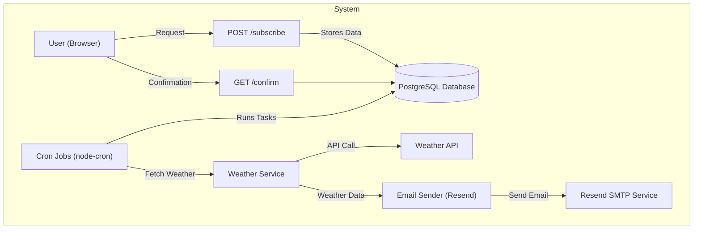

# Weather App – System Design

## Технології

- **Backend:** Node.js (Fastify)
- **ORM:** Prisma
- **Database:** PostgreSQL
- **Hosting:** Render Cloud Services
- **Email Service:** Resend
- **Weather API Provider:** Weather API

---

## Функціональні вимоги

1. Користувач може підписатися на email-розсилку прогнозу погоди:
   - `HOURLY` або `DAILY`
   - Для конкретного міста
2. Користувач отримує email з актуальним прогнозом у заданий час
3. Система підтримує підтвердження підписки (через токен)
4. Система надає користувачу можливість відписатись від розсилки

---

## Нефункціональні вимоги

1. **Масштабованість:** Підтримка великої кількості користувачів із частими розсилками
2. **Доступність:** Сервер має бути доступний 24/7
3. **Продуктивність:** Розсилки виконуються швидко, з обробкою помилок
4. **Безпека:** Валідація вхідних даних

---

## Mermaid Diagram – Архітектура додатку

---

## Потенційні розширення

- Авторизація через email/Google
- Кешування запитів до стороннього погодного API
- Відстеження успішності/невдач розсилок
- Налаштування лімітів використання API

